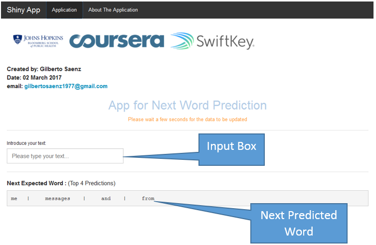

Coursera Data Science Capstone Project
========================================================
author: Gilberto Saenz Hernandez
date: 23-March-2017
autosize: false

This presentation is abrief description of [App for Next Word Prediction.](https://gsaenz1977.shinyapps.io/FinalProject/)
The application is the final project for the Coursera Data Science Specialization at Johns Hopkins University and in cooperation with SwiftKey.

The Objective
========================================================
The main goal of this capstone project is to build a shiny application that is able to predict the next word. 

* The **App for Next Word Prediction** is hosted on [shinyapps.io](https://gsaenz1977.shinyapps.io/FinalProject/)

* The code of this application, milestone report, and this presentation, can be found in [GitHub repo](https://github.com/Gsaenz1977/WordPrediction)

* The final milestone report can be found in [RPubs](https://rpubs.com/Gsaenz1977/milestonereport)

Methodology
========================================================
The summary of the methodology aplied is:
* Understanding the problem
* Data acquisition and cleaning
* Exploratory analysis and statistical modeling
* Predictive modeling
* Creating a data product
* Creating a short slide deck pitching your product

The application gives the user 4 potential words to use, similar to SwiftKet application used by smart phones

Methodology 
========================================================
After creating a data sample from the SwiftKey data set, this sample was cleaned by:
* Removing: Unnecesary Punctuation, Unnecesary White Spaces, Special Characters, Numbers and Moving all Words to Lower Case

After data the sample data is grouped into n-grams, which is a contiguous sequence of n items from a given sequence of text or speech. For this application I'm creating:
* uni-gram(1), bi-gram(2), tri-gram(3), quad-gram(4). 

How to Use the Application
========================================================
Once the application is launched, **it will take aprox. 10 secs to access the n-grams**, then the user will be able to type any sentence or word and the application will suggest/predict 4 different words to be typed in

